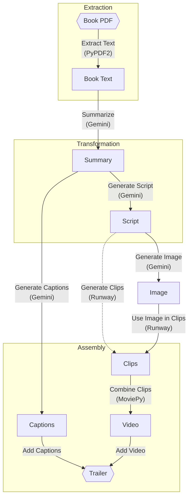

<p align="center">
  
</p>

# boovie

automatically generate movie trailers with a pdf of a book

## Table of Contents 🧾
* [Why boovie](#why-boovie)
* [How it Works](#how-it-works-)
* [Challenges](#challenges-)
* [How can we improve?](#how-can-we-improve-)
* [License](#License)

## why boovie❓
Books hold incredible stories, but reaching new audiences is challenging in a media-saturated world. Boovie bridges this gap by using state-of-the-art AI to transform written stories into cinematic trailers, giving authors, publishers, and readers a powerful new tool to experience, market, and share books. Trailers are proven to captivate audiences, and Boovie empowers every book—no matter its genre or reach—to compete in the visual age. 

## how it works 💻

This diagram shows the workflow for generating a video trailer from a book PDF.



The user uploads a pdf of a book through the React frontend built on Mantine components. We can split our movie trailer creation pipeline into three parts: Extraction, Transformation, and Assembly.

### Extraction
The pdf of the book is extracted into a .txt through the PyPDF2 package.

### Transformation
Due to Gemini’s 2m+ token context window, we upload the entire text of the book and carefully prompt the model to provide a 6-part summary of the story. This summary is stored into a file under /data/summary/summary.txt.

Once the summary is created, we carefully prompt Gemini again to create an extremely visual 6-part script that will be used to prompt Runway’s Gen3-Alpha-Turbo video generation model. Note that the script barely tells anything about the story, which is why the summary is necessary. An example line from a script is as follows: 

```txt
“Over-the-shoulder shot, A young man watches as the couple stands in the heart of the lavish mansion, their backs to him, their faces lost in the moment. He watches them, his face clouded with a mix of sadness and concern. The scene is lit by a soft, warm light, casting a gentle glow on their faces. The camera slowly zooms in on the young man's face, revealing a mix of emotions - confusion, worry, and a hint of frustration. The film uses a gritty, realistic style, capturing the emotional turmoil of the moment. The mood is one of unease and growing suspicion.”
```

Runway’s Gen3-Alpha-Turbo API requires an input image along with text input. As such, we took the scene description and prompted Gemini Imagen to generate a starting scene for the shot. Both the image and the script line are passed to Gen3-Alpha-Turbo. Currently, Gen3-Alpha-Turbo is limited to 5 second videos so we conduct this process 6 times to make 6 clips (to create a 30-second trailer). 

We also carefully prompted Gemini to generate 6 short captions for each of the summary parts to be used in the final movie trailer. The raw text for this was converted into a .srt, which is the standard format for captions – it looks like the following:

```srt
1
00:00:00,000 --> 00:00:05,000
He came home a hero, but the war never left him.

2
00:00:05,000 --> 00:00:10,000
A life of excess, shrouded in mystery.
```

### Assembly
The 6 clips are assembled using MoviePy. Once the 30-second video is made, the captions are laid over using the .srt created earlier. This file is posted back to the frontend with Flask.


## challenges 👎

One of the most significant challenges we faced was understanding which prompt gave the best results when we input them into Runway’s API. Every video generated during the testing phase took 50 credits per request. In total, we burned through more than $80 of credits. AI generated images and videos also struggle with continuity issues, often generating out-of-context scenes while burning our credits. To overcome this, we needed to develop a sophisticated approach for generating prompts to have as much control as we could in what Runway would generate. AI platforms such as Gemini and Runway AI are essentially black boxes and leave too much room for random chance with drastic variations in between generated versions.

## how can we improve? 🤔

Deploying Boovie before moving on to improve compatibility with mobile devices would unlock real-time video generation for more users, enabling seamless, portable access to those interested in checking out or purchasing books in a library/bookstore setting. 

Additionally, while the current model depends on Gemini’s image generation, implementing a web scraping algorithm would allow Boovie to generate even more realistic videos with accurate references created by existing cinematic or informal adaptations. Finally, implementing multithreading to generate multiple book pdf files simultaneously would enable users to create trailers for an entire series or numerous books of interest at once, significantly expediting the video generation process.

## license 📜

Copyright 2024 ©Vineeth Sendilraj, John Kim, Frank Chang, Alex Chen

Permission is hereby granted, free of charge, to any person obtaining a copy of this software and associated documentation files (the "Software"), to deal in the Software without restriction, including without limitation the rights to use, copy, modify, merge, publish, distribute, sublicense, and/or sell copies of the Software, and to permit persons to whom the Software is furnished to do so, subject to the following conditions:

The above copyright notice and this permission notice shall be included in all copies or substantial portions of the Software.

THE SOFTWARE IS PROVIDED "AS IS", WITHOUT WARRANTY OF ANY KIND, EXPRESS OR IMPLIED, INCLUDING BUT NOT LIMITED TO THE WARRANTIES OF MERCHANTABILITY, FITNESS FOR A PARTICULAR PURPOSE AND NONINFRINGEMENT. IN NO EVENT SHALL THE AUTHORS OR COPYRIGHT HOLDERS BE LIABLE FOR ANY CLAIM, DAMAGES OR OTHER LIABILITY, WHETHER IN AN ACTION OF CONTRACT, TORT OR OTHERWISE, ARISING FROM, OUT OF OR IN CONNECTION WITH THE SOFTWARE OR THE USE OR OTHER DEALINGS IN THE SOFTWARE.

